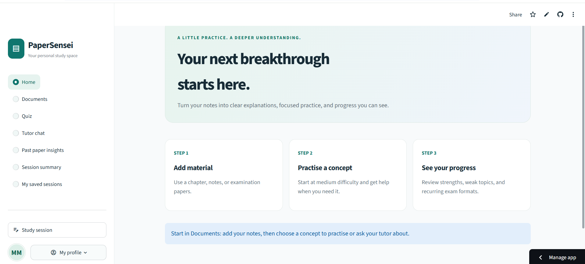
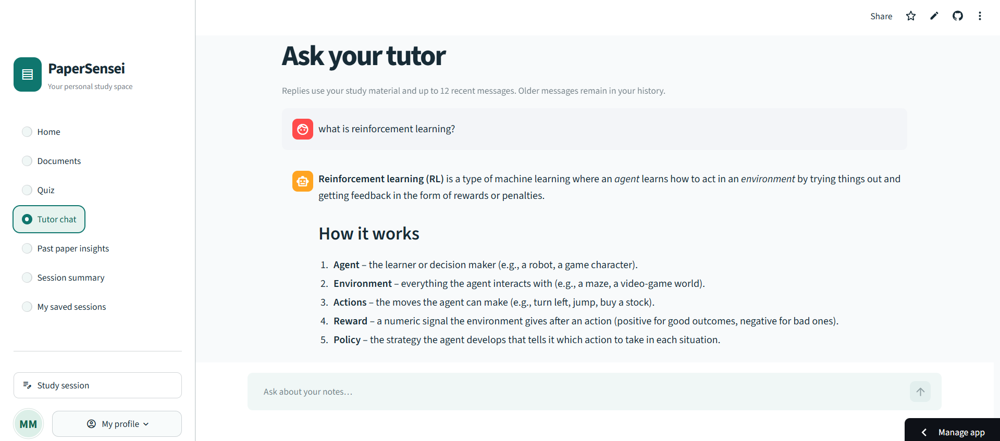
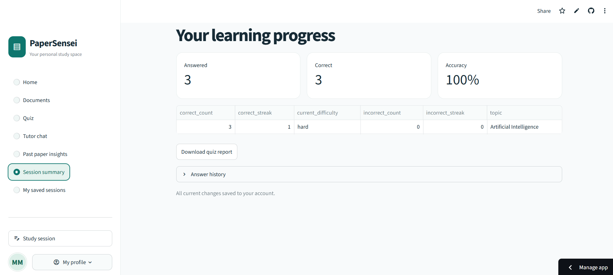

# PaperSensei

**An AI study assistant for conceptual learning and exam preparation.**

PaperSensei helps students practise from their own notes and textbooks. Upload a text-based PDF or paste study material to generate conceptual quizzes, understand mistakes, and ask questions through an AI tutor. Topic-based difficulty adjustment and saved sessions help students continue learning at their own pace.

## Features

- **Study from your documents.** Extract PDF text with page references, preview the content, and choose a section to study.
- **Practise conceptual questions.** Generate multiple-choice questions based on selected material and receive immediate answer feedback.
- **Adapt practice by topic.** Difficulty changes with consecutive correct or incorrect answers. Mistakes lead to simpler explanations and easier follow-up questions.
- **Ask an AI tutor.** Discuss the current material in a conversation saved with your study session.
- **Explore past papers.** Review topic counts and question frequencies across the paper sections you add.
- **Review progress.** See topic performance and download a session summary as CSV.
- **Save and resume.** Use a verified email account to save sessions and conversations, or try guest mode without cloud storage.

## Screenshots

### Study workspace

A central workspace for adding material, starting practice and reviewing progress.



### AI tutor

Ask questions about your study material and explore concepts through follow-up conversations.



### Learning progress

Review answers, accuracy and topic difficulty, then download a quiz report.



## Technology stack

| Technology | Purpose |
| --- | --- |
| Python | Application logic, grading and adaptive practice |
| Streamlit | Interactive web interface |
| pdfplumber | PDF text extraction and page references |
| Groq API | Concepts, questions, explanations and tutor replies |
| Firebase Authentication | Email and password accounts, verification and password reset |
| Cloud Firestore | Saved study sessions and conversations |
| pytest and GitHub Actions | Automated tests and continuous integration |

## Getting started

### Prerequisites

- Python 3.11 or newer.
- A Groq API key for AI features.
- A Firebase project for account access and cloud saving. Firebase is optional for guest use.

### 1. Clone the repository

```bash
git clone https://github.com/mubashir72/PaperSensei.git
cd PaperSensei
```

### 2. Install dependencies

**Windows PowerShell**

```powershell
python -m venv .venv
.venv/Scripts/python -m pip install -r requirements.txt
if (-not (Test-Path .env)) { Copy-Item .env.example .env }
```

**macOS or Linux**

```bash
python3 -m venv .venv
.venv/bin/python -m pip install -r requirements.txt
test -f .env || cp .env.example .env
```

### 3. Configure the environment

Add your credentials to `.env`:

```dotenv
GROQ_API_KEY=your_groq_api_key
GROQ_MODEL=openai/gpt-oss-20b

# Optional for accounts and cloud saving
FIREBASE_API_KEY=your_firebase_web_api_key
FIREBASE_PROJECT_ID=your_firebase_project_id
```

`GROQ_MODEL` selects the model used for AI requests. Use a model available to your Groq account. Keep `.env` out of version control and restart the app after changing settings.

For Firebase accounts:

1. Enable **Email/Password** in Firebase Authentication.
2. Create the default Cloud Firestore database.
3. Publish the contents of [firestore.rules](firestore.rules) in the Firestore rules editor.
4. Register through the app and verify your email before opening the account workspace.

The app uses each user's Firebase ID token. A Firebase Admin service account is not required. See [Firebase setup](FIREBASE_SETUP.md) for configuration and storage details.

### 4. Run the app

**Windows PowerShell**

```powershell
.venv/Scripts/python -m streamlit run app.py
```

**macOS or Linux**

```bash
.venv/bin/python -m streamlit run app.py
```

Open the local URL printed in your terminal, usually `http://localhost:8501`.

## Using PaperSensei

1. **Load material.** Open Documents, paste notes or upload a PDF, preview the text, and select a section to study.
2. **Practise.** Extract concepts, open Quiz, choose a topic, and generate a question.
3. **Learn from feedback.** Submit an answer and review the explanation. After a mistake, complete an easier follow-up on the same topic.
4. **Ask questions.** Open Tutor chat to discuss the current material.
5. **Analyze past papers.** Add paper sections through Documents and open Past paper insights to review topic frequencies.
6. **Review and continue.** Open Session summary to view results and download a report. Verified users can resume work through My saved sessions.

### Adaptive practice

Each topic starts at medium difficulty. Two consecutive correct answers raise the level, and two consecutive incorrect answers lower it. Levels stay within easy, medium and hard. Each level change resets that streak, so another change requires a new pair of answers.

Every incorrect answer schedules a follow-up one level below the question answered. Easy questions remain easy. Follow-up answers count toward topic performance, and a submitted answer is graded only once.

### Accounts and saved work

Verified users can save source text, quiz progress, past-paper insights and tutor conversations. Raw PDF files are not stored. Resetting the workspace starts a new session and preserves previously saved cloud sessions.

If saving fails, the app shows an error and keeps local work available for retry. Guest progress lasts only for the current browser session and is not saved to Firebase.

## Project structure

```text
PaperSensei/
  app.py               Application interface and navigation
  config.py            Settings, limits and secret loading
  modules/             PDF processing, AI services, quizzes and accounts
  prompts/             Instructions for source-based AI responses
  tests/               Unit and interface tests
  scripts/             Diagnostic utilities
  .streamlit/          Streamlit configuration
  .github/workflows/   Continuous integration
  firestore.rules      Rules for account-specific data access
```

## Testing

Install the development dependencies and run the test suite:

```powershell
.venv/Scripts/python -m pip install -r requirements-dev.txt
.venv/Scripts/python -m pytest -q
```

On macOS or Linux, replace `.venv/Scripts/python` with `.venv/bin/python`.

Tests cover adaptive progression, grading, PDF handling, AI response validation, account behavior and the Streamlit interface. AI calls are mocked for offline testing. GitHub Actions runs the suite on pushes and pull requests.

## Deployment

To run the project on Streamlit Community Cloud, connect this repository and select `app.py` as the entry point. Add credentials in the app's secrets settings using TOML:

```toml
GROQ_API_KEY = "your_groq_api_key"
FIREBASE_API_KEY = "your_firebase_web_api_key"
FIREBASE_PROJECT_ID = "your_firebase_project_id"
```

Firebase entries are needed only for accounts and cloud saving. Configure Authentication and publish the Firestore rules as described above. Do not upload your local `.env` file.

## Supported documents and limitations

- PDF uploads support text-based documents up to 20 MB, 500 pages and 2 million extracted characters per file.
- Each selectable source section contains up to 24,000 characters. Past-paper analysis covers only the sections you add, so select sections containing complete questions.
- Scanned documents requiring OCR and password-protected PDFs are not supported.
- Quizzes currently support multiple-choice questions. Progress is tracked per study session.
- AI responses can contain mistakes. Check important explanations against the original material.
- Past-paper frequencies describe the supplied papers and do not predict future exam questions.
